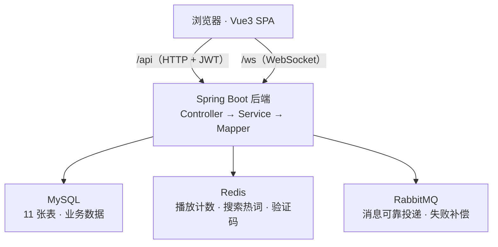

# my13li13li · 视频社区全栈项目

> 仿 B 站风格的视频社区 + 会员充值系统，一个从 0 到 1 落地的全栈练习项目。
> 前端 Vue3 + 后端 Spring Boot 3，覆盖视频、互动、关注、私信、会员订单等完整业务闭环。

## 项目简介

一个麻雀虽小、五脏俱全的视频社区：用户上传/审核/播放视频、点赞收藏投币、楼中楼评论、关注 UP 主、实时私信、搜索热词、个人中心、会员充值（订单 + 消息队列可靠投递）、通知红点。所有模块均含教学级中文注释，配套分模块开发指南。

## 功能特性

| 模块 | 功能 | 核心实现 |
|---|---|---|
| 账号体系 | 用户名密码登录 / 手机号验证码登录 / 注册 / JWT 鉴权 | Spring Security + JWT，角色分普通/管理员 |
| 视频上传 | 投稿、封面、分类；无封面时 FFmpeg 自动抽首帧 | FFmpeg 命令行抽取 + MQ 异步回写 + 30s 超时容错 |
| 视频管理 | 审核、下架 / 重新上架、删除（级联清理通知与磁盘文件） | 角色校验 + 事务 |
| 播放计数 | 高并发播放量计数 | Redis `INCR` 增量 + `@Scheduled` 定时落库 |
| 互动体系 | 点赞 / 收藏 / 投币（每日 3 枚）/ 评论（楼中楼） | Redis Set 去重、投币 Redis 原子计数、自关联表、事务 |
| 首页推荐 | 分类筛选 + 最新 / 最热排序 + 关注动态流 | 多条件查询 |
| 搜索 | 关键词搜索 + 热词排行 + 搜索历史 | MySQL LIKE + Redis TTL |
| 个人中心 | 我的视频 / 收藏 / 历史 / 关注 / 粉丝 / 会员信息 | 关系表设计 |
| 关注 + 私信 | 关注管理、抖音式单向私信规则、WebSocket 实时推送 | 双行会话表 + 原生 WS + JWT 握手鉴权 |
| 通知 | 系统通知 + 未读红点 | 轮询 + WS 增量双通道 |
| 会员充值 | 白银 / 黄金 / 钻石等级、订单支付、延时关单、到期升级 | RabbitMQ 可靠投递 + 定时补偿 |
| 管理员审核台 | 全站视频审核、驳回 | 角色权限 |

## 技术栈

**后端**

| 技术 | 用途 |
|---|---|
| Spring Boot 3.2 / Java 17 | 核心框架 |
| MyBatis-Plus 3.5.5 | ORM |
| MySQL 8 | 数据存储 |
| Redis | 计数、去重、验证码、热词、幂等 |
| RabbitMQ | 订单关单 / 会员升级消息 |
| Spring Security + JWT | 认证授权 |
| WebSocket | 私信实时推送 |
| FFmpeg | 视频封面自动抽取 |

**前端**

| 技术 | 用途 |
|---|---|
| Vue 3.4（Composition API） | 视图层 |
| Vite 5 | 构建工具 |
| Vue Router 4 | 路由 |
| axios | HTTP 请求封装 |
| 原生 WebSocket | 私信实时通信 |

## 系统架构



关键设计：

- **播放量 / 点赞计数**：Redis 原子自增，定时任务刷库，高并发不丢
- **MQ 可靠投递**：生产端失败自动入 Redis 失败队列，定时补偿重发
- **私信会话**：双行会话表（每对用户两行，各存未读数），单表查询免 join；非互关时遵循"对方回复前只能发一条"的抖音式规则
- **JWT 鉴权**：无状态，前端拦截器自动携带 token，401 自动弹出登录框

## 数据库设计（11 张表）

| 分组 | 表 |
|---|---|
| 用户 | `user`（含会员等级 / 角色 / 状态） |
| 订单 | `member_order`（订单状态机 + 幂等键） |
| 视频 | `video`（分类 / 状态 / 四维计数） |
| 互动 | `video_comment`（楼中楼：parent_id + root_id）、`video_favorite`、`video_coin`、`watch_history` |
| 社交 | `user_follow`、`user_notification` |
| 私信 | `dm_conversation`（双行会话）、`dm_message` |

## 项目结构

```
backend/                          # Spring Boot 后端
├── src/main/java/com/example/practice/
│   ├── controller/               # 接口层
│   ├── service/ + impl/          # 业务层
│   ├── mapper/                   # MyBatis-Plus Mapper
│   ├── entity/ dto/ vo/          # 数据模型
│   ├── config/                   # 安全 / MQ / WebSocket 配置
│   ├── util/                     # JWT / 上传（含 FFmpeg 抽帧）
│   ├── task/                     # 定时任务（计数落库 / MQ 补偿）
│   ├── listener/                 # MQ 消费者
│   └── ws/                       # WebSocket 处理器
└── src/main/resources/db/init.sql  # 建库建表 + 种子数据（幂等可重放）

frontend/                         # Vue3 前端
├── src/
│   ├── views/                    # 页面（首页/上传/详情/搜索/个人中心/私信…）
│   ├── components/               # 组件（导航栏/视频卡片/登录弹窗…）
│   ├── api/                      # 接口封装（axios 统一拦截）
│   ├── store/                    # 全局状态（用户/私信红点）
│   └── router/                   # 路由
└── vite.config.js                # dev 代理 /api、/upload

docs/                             # 按功能模块划分的开发指南（09 份）
```

## 本地快速启动

**依赖**：JDK 17、Maven、Node 18+、MySQL 8、Redis、RabbitMQ（可选，不启动则订单/MQ 功能不可用）

**① 初始化数据库**

```bash
mysql -uroot -p < backend/src/main/resources/db/init.sql
```

脚本可重复执行（先 DROP 再全量重建），内置种子数据：12 条视频、5 个用户、管理员账号。

**② 启动后端**

```bash
cd backend
mvn spring-boot:run          # 默认 8080 端口
```

可在 `application.yml` 通过环境变量覆盖数据库密码等敏感配置。

**③ 启动前端**

```bash
cd frontend
npm install
npm run dev                  # http://localhost:5173
```

dev 模式已配置代理：`/api` → `localhost:8080`，`/upload` → 后端静态目录。

### 测试账号

| 账号 | 密码 | 角色 |
|---|---|---|
| admin | 123456 | 管理员 |
| user0002 ~ user0005 | 123456 | 普通用户（也可手机号验证码登录） |

## 文档

按功能模块划分的系列开发文档（中文教学式，含关键代码与设计讲解）：

| 模块 | 文档 |
|---|---|
| 账号认证 | [01-账号认证](docs/01-账号认证.md) |
| 视频内容 | [02-视频上传与管理](docs/02-视频上传与管理.md) |
| 互动体系 | [03-互动体系](docs/03-互动体系.md) |
| 社交关系 | [04-关注与私信](docs/04-关注与私信.md) |
| 搜索 | [05-搜索功能](docs/05-搜索功能.md) |
| 个人中心 | [06-个人中心](docs/06-个人中心.md) |
| 通知 | [07-通知系统](docs/07-通知系统.md) |
| 会员订单 | [08-会员订单](docs/08-会员订单.md) |
| 前端基建 | [09-前端工程化](docs/09-前端工程化.md) |
